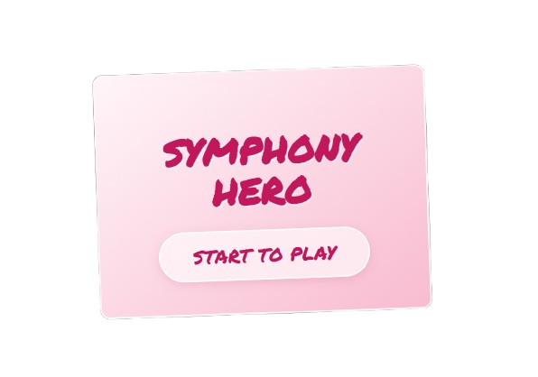

  

# 🎼 Symphony Hero

**Symphony Hero** is a minimalist, rhythmic arcade game inspired by the spirit of *Flat Heroes*.
You play as a small square surviving against waves of aggressive musical notes on an animated sheet music background.

## 🎮 How to Play

The goal is simple: survive the waves and defeat enemies to reach the target score.

### 🕹️ Controls
* **Move:** Arrows `⬅️` `➡️` or `A` / `D`
* **Jump:** Arrow `⬆️`, `W` or `Space`
* **ATTACK (Dash):** `SHIFT` + Direction keys

### ⚔️ Rules (Very Important!)
The game relies on a **Dash mechanic**:

1.  **When you are BLACK ⚫:** You are vulnerable. If a note touches you, you lose a heart ❤️.
2.  **When you are CYAN/BLUE (Dashing) 🔵:** You are in **ATTACK mode**. Dash into enemies to destroy them and score points!

### 🏆 Levels
The game progresses through 3 distinct rounds:
1.  **Level 1 (Pink):** Gentle introduction.
2.  **Level 2 (Blue):** Staircase platforms layout.
3.  **Level 3 (Yellow):** Hard mode, scattered platforms.

